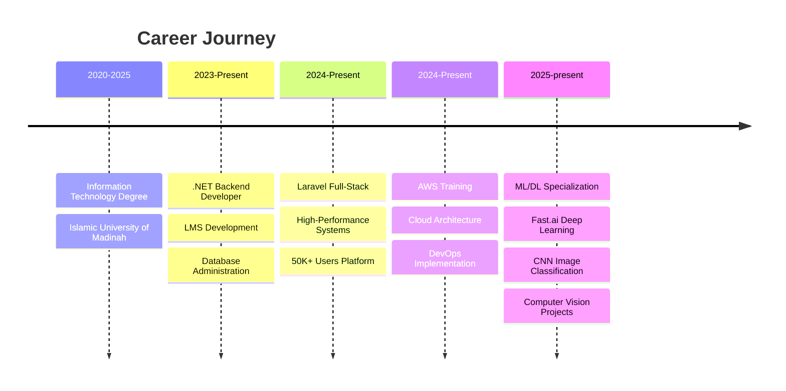

# 💻 Software & Data Engineer

---

## 🚀 Skills Overview

### Backend Development

### Database & Data

### Cloud & DevOps

---

## 📊 GitHub Stats

## 🔥 Contribution Activity

## 💡 Project Highlights

| 🎓 **Learning Management System** | 🎫 **Support Ticket System** | ☁️ **AWS Cloud Solutions** |
|:---:|:---:|:---:|
| .NET Core + SQL Server | Laravel + MySQL | Lambda + API Gateway |
| Multi-department platform | 50K+ users | Serverless architecture |
| Authentication integration | Real-time analytics | CI/CD pipelines |

---

## 🏆 GitHub Achievements

---

## 🎯 Experience Timeline

---

## 🛠️ Tech Stack

<table>
<tr>
<td align="center" width="96">

 .NET
</td>
<td align="center" width="96">

 C#
</td>
<td align="center" width="96">

 Laravel
</td>
<td align="center" width="96">

 PHP
</td>
<td align="center" width="96">

 MySQL
</td>
</tr>
<tr>
<td align="center" width="96">

 MongoDB
</td>
<td align="center" width="96">

 AWS
</td>
<td align="center" width="96">

 Docker
</td>
<td align="center" width="96">

 Git
</td>
<td align="center" width="96">

 Postman
</td>
</tr>
</table>

---

## 📫 Connect

---

**🎯 Building scalable solutions • 📊 Turning data into insights • ☁️ Cloud-native architecture**

